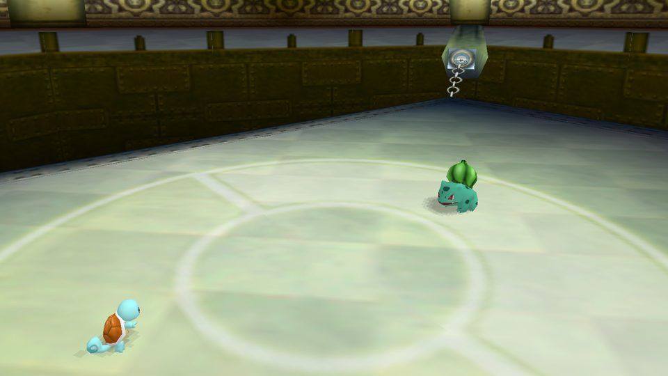
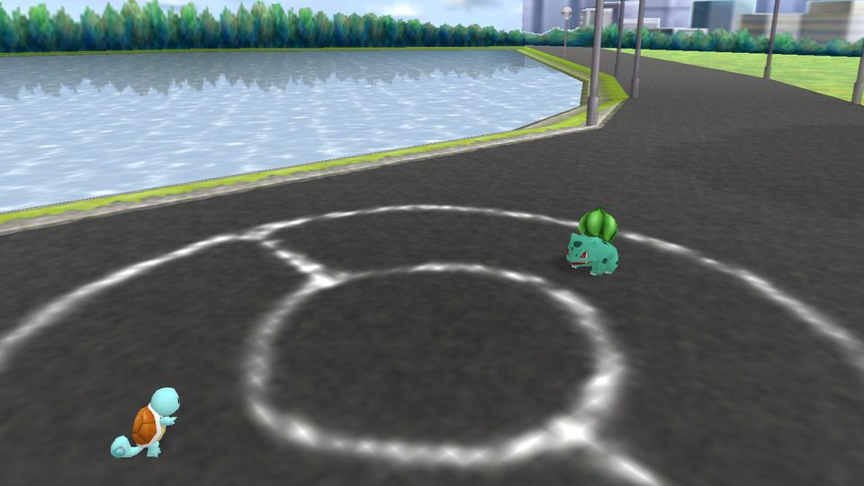
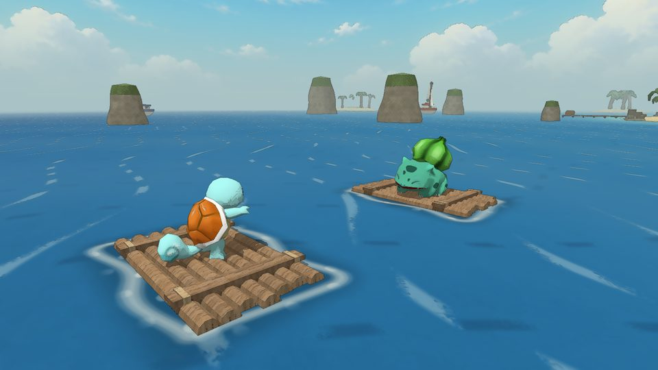
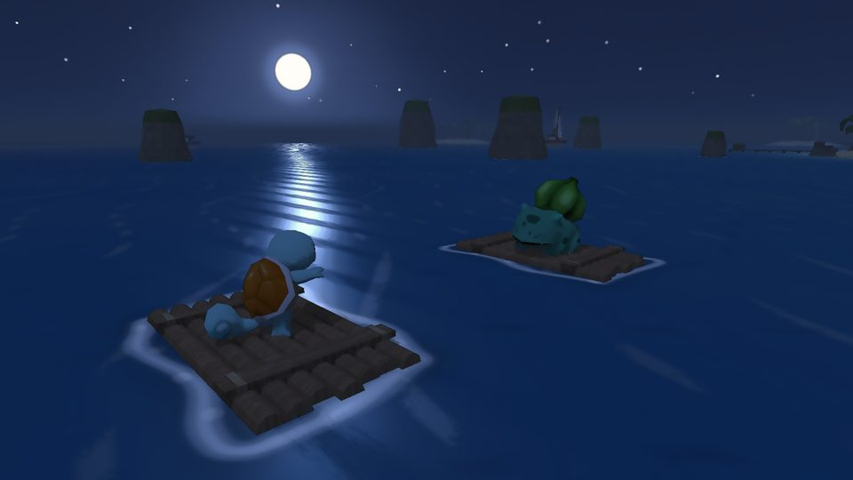
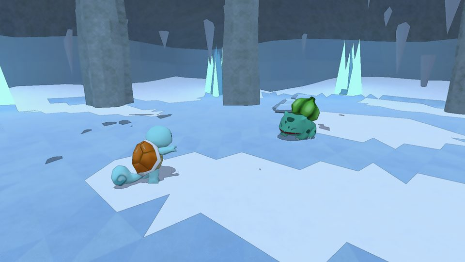
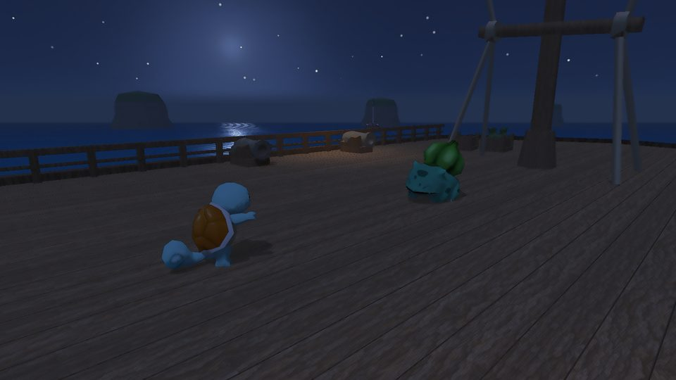
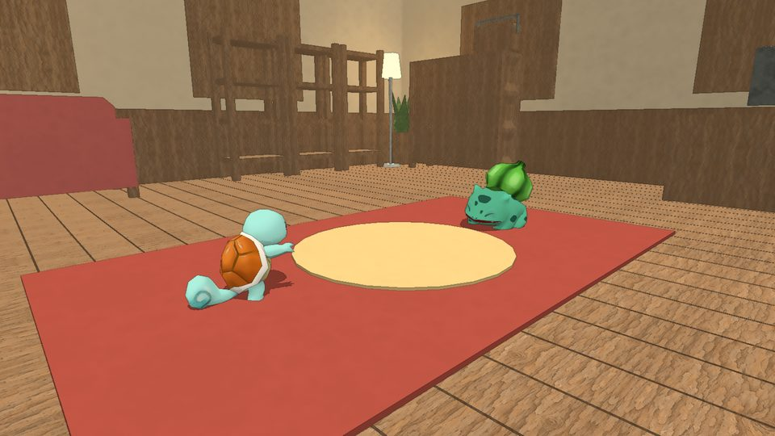
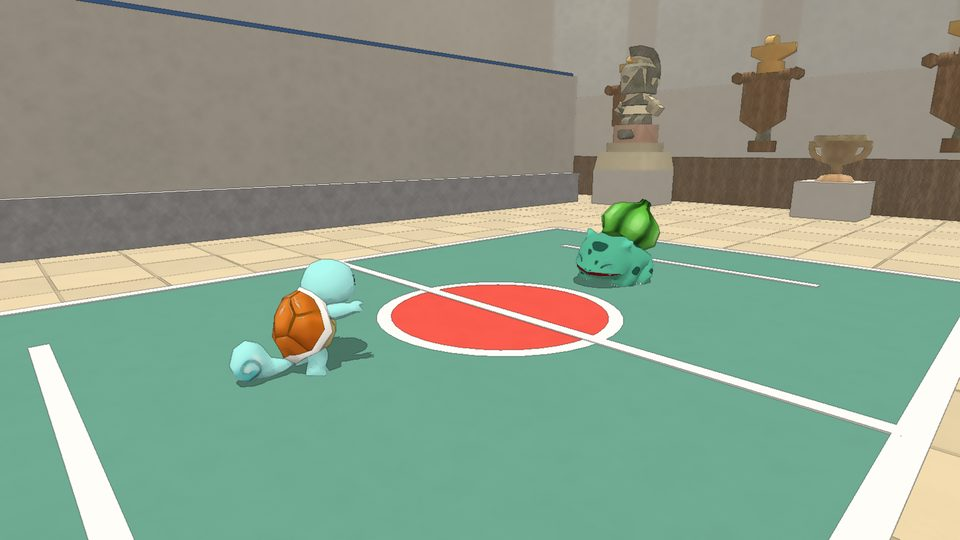
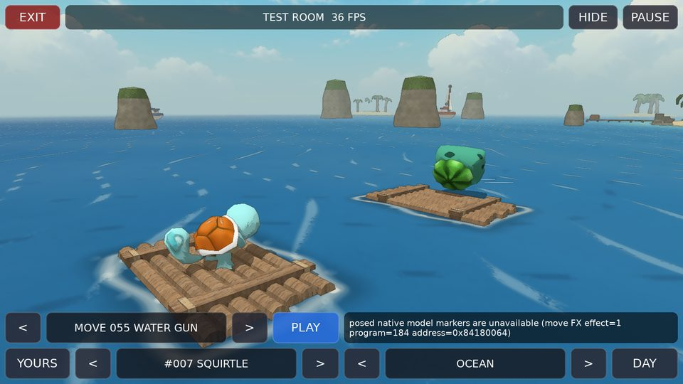

# Pokemon Stadium 2 Importer

3D Pokemon Stadium 2 battles for Gen 1 and Gen 2 games in Gen1Recomp: Stadium
models (normal and shiny, all 251 plus every Unown), animations, battle
arenas, move effects, a free camera and Stadium's glass HUD. The game still
runs the battles; this mod only changes how they look.

| | |
|---|---|
|  |  |
|  |  |
|  |  |
|  |  |

## Setup

1. Install and enable the mod in the Mod Manager.
2. When asked, import your own **Pokemon Stadium 2 (USA)** ROM (`.z64`,
   `.v64` or `.n64`). MD5: `1561c75d11cedf356a8ddb1a4a5f9d5d`.
3. Start the game. Models are imported once, with a progress screen; after
   an update that changes the format, they are re-imported automatically.

No ROM is included. Never add one to the mod ZIP.

## Battle scenes

- **Gyms** use the leader's Stadium 2 arena.
- **Elsewhere**, with `BATTLE ENVIRONMENT` set to `KENNEY NATURE`, battles
  use a painted scene matched to where you are: woodland, cave, lake, town,
  ocean, mountain, ice cave, homes, factories, ruins, ships, the League,
  underground lakes and indoor pools.
- `CLASSIC` keeps the simple classic battle stage.

## Options

| Option | What it does |
|---|---|
| 3D POKEMON MODELS | Stadium models on or off. |
| 3D BATTLE SCENE | The 3D battle presentation on or off. |
| BATTLE HUD | Stadium's glass HUD; turn off to use the native or another mod's UI. |
| GRAPHICS | Shows the graphics settings below. |
| SHADER STYLE | `STADIUM` or `WATERCOLOR MANGA`. |
| 3D RESOLUTION | `AUTO`, 100%, 75% or 50%. Lower is faster; the UI stays sharp. |
| BATTLE AA | Anti-aliasing: off, 2x or 4x. |
| EXTRA EFFECTS | `LITE` or `OFF` cuts particles, shadows, weather and visitors for slow phones. |
| POKE BALL | Stadium's send-out effect. |
| SCENE WEATHER | Rain or thunderstorms in outdoor scenes. |
| BATTLE ENVIRONMENT | `CLASSIC` or the painted `KENNEY NATURE` scenes. |
| AMBIENT POKEMON | Harmless visitors in the painted scenes. |
| TEST ENVIRONMENT / TEST ARENA | Force a scene or arena for your next battle. |
| TEST ROOM | Opens the test room (below). |
| RAPIDASH CUT PARTICLES | Restores Rapidash's unused flame particles from the ROM. |
| CONTEXT ARENAS (BETA) | Gen 2 trainer battles use their matching Stadium arena. |
| PARK TIME OF DAY (BETA) | Morning, day and night lighting for Free Battle Park. |
| MOVE EFFECTS (BETA) | Stadium 2's own move effects, decoded from your ROM. |

The painted scenes, weather, visitors, Extra Effects and the Poke Ball toggle
are mod additions, not part of Stadium 2.

## Test room

Play any move or battle effect between any two Pokemon, in any scene or
Stadium arena, day or night. Works with touch, mouse, keyboard and gamepad;
`EXIT` returns to the game.

## Camera

- **Mouse:** move to orbit, wheel (or `Q`/`E`) to zoom, `0` to reset.
- **Controller:** right stick.
- **Touch:** drag with one finger, pinch to zoom.

## For developers

The integration API, UI-mod compatibility, rendering notes, tests and tools
are in [docs/INTEGRATION.md](docs/INTEGRATION.md). Release notes are in
[docs/releases](docs/releases).
